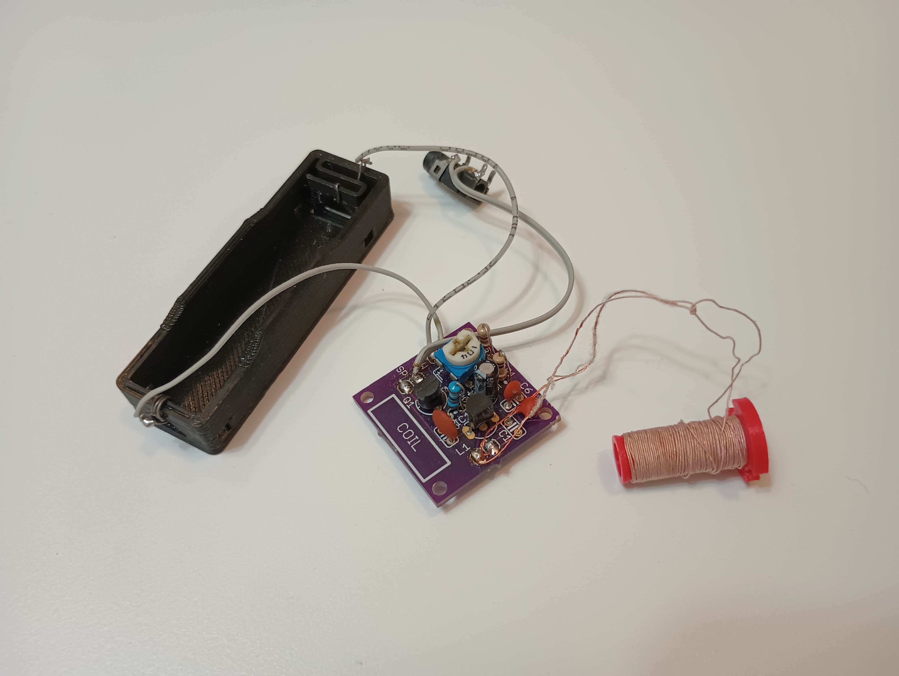
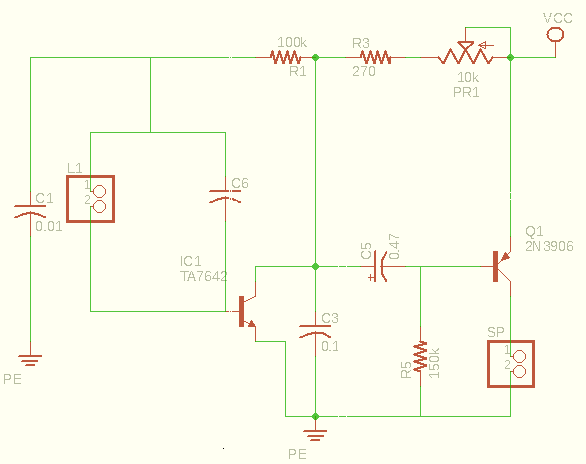

# TA7642 Radio

  

A very tiny pocket AM radio that runs from a single 1.5 V battery. It's a simple, low‑power receiver built around the TA7642 AM demodulator/amplifier IC with a small tuning coil and a coupling transistor to drive headphones. I designed this as a kit and created the PCB in 2021 (a 5th grade project) to learn about radios, basic electronics, and PCB design. More information in the `/docs` folder

## Features
- Pocket‑sized AM radio
- Powered by a single 1.5 V cell (AA/AAA) or possibly a small 1.5V button battery
- TA7642 AM demodulator and amplifier IC
- Tuning via LC tank (coil + variable capacitor)
- Simple output amplifier transistor (Q1) for headphones/earbuds
- Designed as a kit with a compact PCB

## Circuit (overview)
- The LC tank (coil + capacitor) selects the desired AM frequency.  
- The TA7642 performs RF detection (demodulation) and provides a small amount of audio amplification.  
- A single transistor (Q1) follows the TA7642 to raise the audio level enough for headphones or small earbuds.  
- The schematic is shown above (`img/TA7642_radio_sch.png`)..

## Usage
1. Connect a fresh 1.5 V battery (observe polarity).
2. Plug headphones or earbuds into the audio jack or connect to the audio pads.
3. Slowly adjust the ferrite rod in the coil until you hear a station.
4. Fine‑tune the coil/trimmer for best reception and volume.

Note: This radio is optimized for strong local AM stations and will have limited sensitivity compared with larger receivers.

## Tuning and performance tips
- Use low‑impedance earbuds for better volume from the simple output stage.
- If reception is weak, try repositioning the coil or extending an earbud wire as an antenna.
- Small changes in the tuning capacitor or coil turns produce noticeable frequency shifts—tweak gently.
- The TA7642 and a single‑transistor buffer are designed for simplicity and low voltage operation; don't expect the same performance as higher‑powered receivers.

Enjoy building and listening, tiny radios are a great way to learn the fundamentals of RF and analog electronics!
